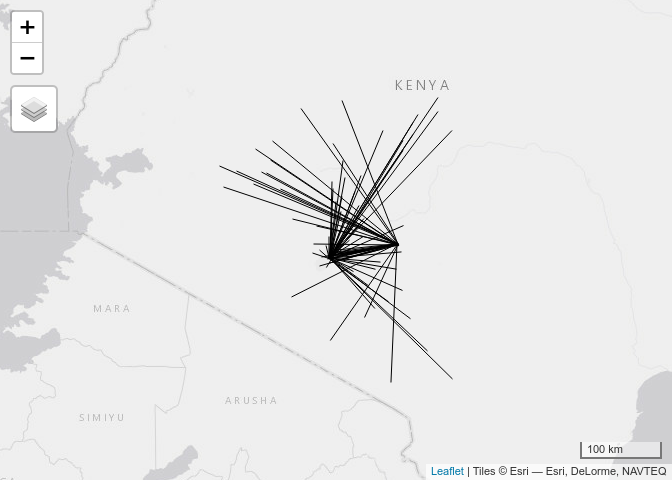
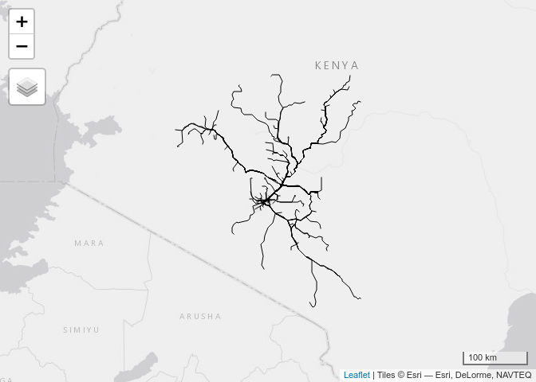
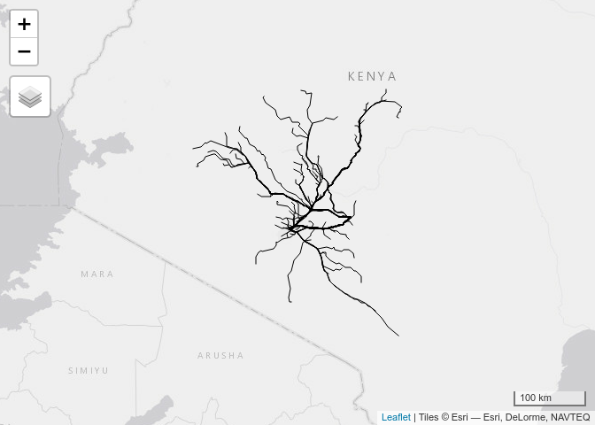

<!-- README.md is generated from README.Rmd. Please edit that file -->

# od_to_routes_osrm

<!-- badges: start -->
<!-- badges: end -->

The goal of od_to_routes_osrm is to demonstrate how to calculate journey
times and geographic routes between OD pairs rapidly with a local
instance of a routing engine (OSRM in the first instance).

Start by reading in the data.

``` r
origins = read_csv("KY_Origins.csv")
#> Rows: 84 Columns: 6
#> ── Column specification ────────────────────────────────────────────────────────
#> Delimiter: ","
#> chr (1): admin2Pcode
#> dbl (5): OID_, XCoord, YCoord, Lat, Long
#> 
#> ℹ Use `spec()` to retrieve the full column specification for this data.
#> ℹ Specify the column types or set `show_col_types = FALSE` to quiet this message.
destinations = read_csv("KY_Destinations.csv")
#> Rows: 2908 Columns: 4
#> ── Column specification ────────────────────────────────────────────────────────
#> Delimiter: ","
#> chr (1): Categorised
#> dbl (3): OID_, Lat, Long
#> 
#> ℹ Use `spec()` to retrieve the full column specification for this data.
#> ℹ Specify the column types or set `show_col_types = FALSE` to quiet this message.
destinations_updated = destinations %>% 
  rename(tx = Lat, ty = Long)
# od::od_points_to_od_all # this function does not exist]
od_matrix = expand.grid(origins$OID_, destinations$OID_)
od_df = as_tibble(od_matrix)
names(od_df)[1] = names(origins)[1]
names(od_df)[2] = "OID_D"
od_df_o = left_join(od_df, origins)
#> Joining, by = "OID_"
names(destinations)[1] = "OID_D"
od_df_od = left_join(od_df_o, destinations_updated)
#> Joining, by = "OID_"
od_df_od_distinct = od_df_od %>% 
  distinct(Lat, Long, tx, ty, .keep_all = TRUE)
od_coords = od_df_od_distinct %>% 
  select(fx = Lat, fy = Long, tx = tx, ty = ty)
od_sf = od::odc_to_sf(odc = od_coords)
od_sf$origin_id = od_df_od_distinct$OID_
od_sf$destination_id = od_df_od_distinct$OID_D
# map with sample of 1000 od pairs
od_sf$length = as.numeric(sf::st_length(od_sf))
summary(od_sf$length)
#>    Min. 1st Qu.  Median    Mean 3rd Qu.    Max. 
#>   13389   62812   86262  108452  164346  236440
od_sf_short = od_sf %>% 
  filter(length < 2000000)

od_sf_short %>% 
  qtm()
```

<!-- -->

Do the routing with OSRM:

``` r
od_routes_osrm = route(l = od_sf_short, route_fun = route_osrm, osrm.profile = "car")
sf::write_sf(od_routes_osrm, "od_routes_osrm.geojson")
```

``` r
od_routes_osrm = sf::read_sf("od_routes_osrm.geojson")
qtm(od_routes_osrm)
```

<!-- -->

``` r
od_routes = route(l = od_sf_short, route_fun = route_google)
sf::write_sf(od_routes, "od_routes.geojson")
```

``` r
od_routes = sf::read_sf("od_routes.geojson")
qtm(od_routes)
```

<!-- -->
